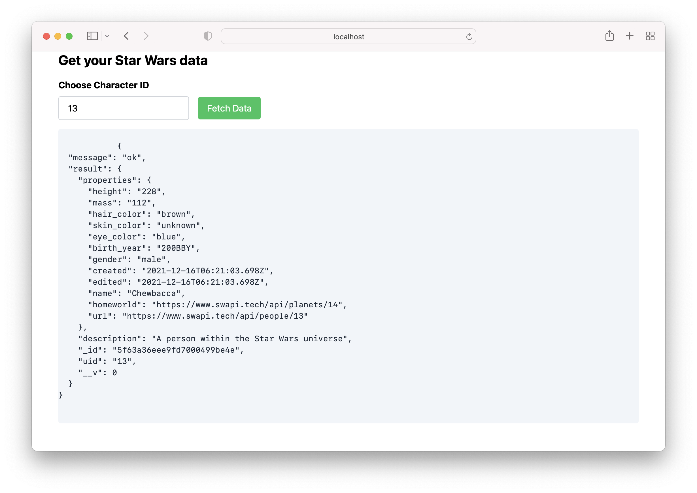

## An experiment of using Nuxt 3 Beta to get data from Star War API

This project is just for fun, not to be used for production.


### Setup

Make sure to install the dependencies

```bash
yarn install
```

### Development

Start the development server on http://localhost:3000

```bash
yarn dev
```
